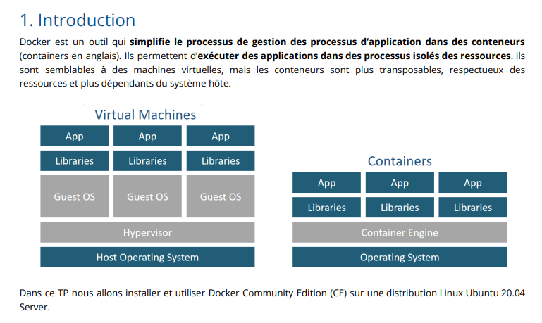
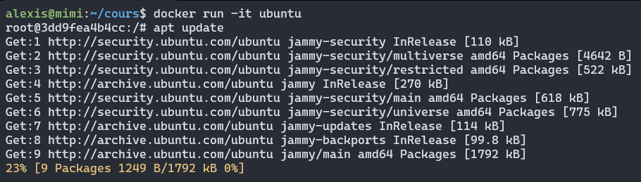

# Introduction

<br>


<br>

# Quels sont les limites de Docker ?

Contrairement à des VMS, vous n'avez pas la possibiltié de répartir les ressources systèmes comme vous le souhaitait (RAM, CPU, etc...).
Par rapport à de la virtualisation, les containers Docker dépendent énormément de la machine hôte.

# Pourquoi utilise-t-on Docker ?

Pour conteneriser des applications. Déployer, tester des applications dans un processus de développement ou de production.

# Définitions

**Images** - Le système de fichiers et la configuration de notre application utilisés pour créer des conteneurs. Pour en savoir plus sur une image Docker, exécutez docker image inspect alpine.

**Conteneurs** - Exécution d'instances d'images Docker - les conteneurs exécutent les applications réelles. Un conteneur inclut une application et toutes ses dépendances. Il partage le noyau avec d'autres conteneurs et
s'exécute comme un processus isolé dans l'espace utilisateur du système d'exploitation hôte.

**Docker daemon** - Service d'arrière-plan s'exécutant sur l'hôte qui gère la construction, l'exécution et la distribution des conteneurs Docker.

**Client Docker** - L'outil de ligne de commande qui permet à l'utilisateur d'interagir avec le démon Docker.

**Docker Store** - est, entre autres, un registre d'images Docker. Vous pouvez considérer le registre comme un répertoire de toutes les images Docker disponibles

# *Commandes*

## Lancer un container avec l'image hello-world.

```bash
$ sudo docker run hello-world

Hello from Docker!
This message shows that your installation appears to be working correctly.

To generate this message, Docker took the following steps:
 1. The Docker client contacted the Docker daemon.
 2. The Docker daemon pulled the "hello-world" image from the Docker Hub.
    (amd64)
 3. The Docker daemon created a new container from that image which runs the
    executable that produces the output you are currently reading.
 4. The Docker daemon streamed that output to the Docker client, which sent it
    to your terminal.

...
```
*On peut mettre à jour l'image, avec la commande suivante :*

```bash
sudo docker pull hello-world
```

## Lancer un container avec l'image ubuntu et ouvrir un shell bash.

```bash
$ sudo docker run -it ubuntu bash

Unable to find image 'ubuntu:latest' locally
latest: Pulling from library/ubuntu
e96e057aae67: Already exists
Digest: sha256:4b1d0c4a2d2aaf63b37111f34eb9fa89fa1bf53dd6e4ca954d47caebca4005c2
Status: Downloaded newer image for ubuntu:latest
root@dd5fb27bfd46:/# ls
bin  boot  dev  etc  home  lib  lib32  lib64  libx32  media  mnt  opt  proc  root  run  sbin  srv  sys  tmp  usr  var
root@dd5fb27bfd46:/#
```

## Exécuter un conteneur

```bash
# Execute without sudo
docker run -it ubuntu
# Execute with sudo
sudo !! / sudo docker run -it ubuntu
```



<br>

## Gérer les containers

- Lister les containers actifs : `docker ps`

- Lister tous les containers : `docker ps {-a|--all}`

- Voir le dernier container créé : `docker ps -l`

- Gestion de l'état :

   - Lancer le container : `docker start 62681cdc60b2 | ubuntu`

   - Stopper le container : `docker stop 62681cdc60b2 | ubuntu`

   - Supprimer le container : `docker rm 62681cdc60b2 | ubuntu`

- Attribuer un nom à la création : 

```
$ docker run --name hello hello-world
$ docker ps -a
CONTAINER ID   IMAGE         COMMAND        CREATED              STATUS                      PORTS     NAMES
0888fa1f72e1   hello-world   "/hello"       26 seconds ago       Exited (0) 26 seconds ago             hello
$ docker rm hello
hello
```